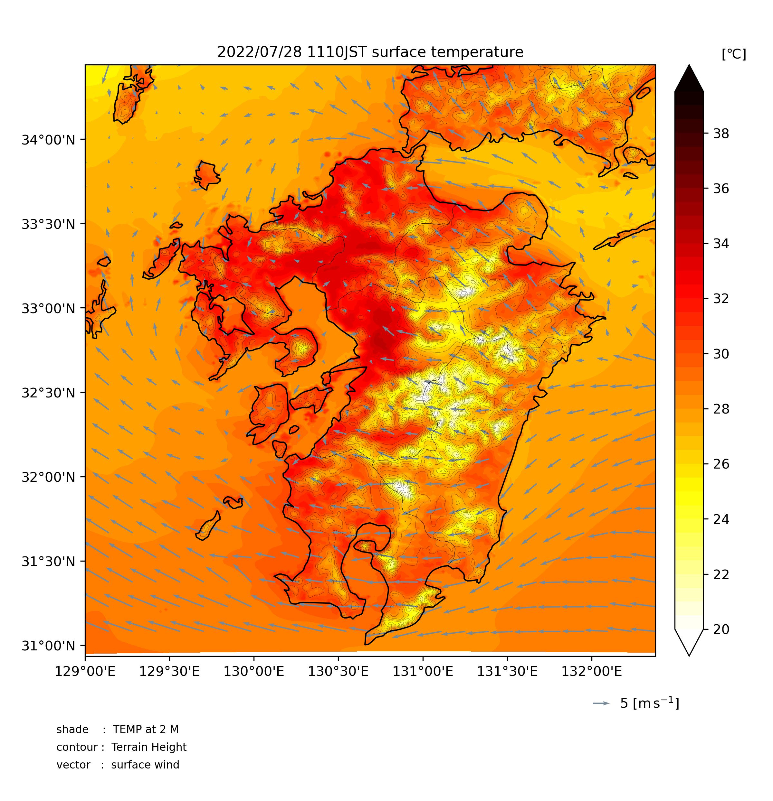

# WRF Horizontal Drawing

領域気象モデルWRFのシミュレーション結果を描画します。




## 仮想環境

conda

```bash
conda env create -f requirements.yml
conda activate wrf
```

## Usage

`data/wrfout`下にシミュレーション結果のnetcdfファイルを配置し、<br>
`src/constants/configureation.py`で描画範囲等を設定します。

```bash
python src/main.py
```

を実行して、画像やGifを作成します。<br>
作成された画像は `img`下に出力されます。

## Note

   描画変数名は、`data/information`下に出力されるテキストファイル及び[公式ドキュメント](https://wrf-python.readthedocs.io/en/latest/user_api/generated/wrf.getvar.html#wrf.getvar)を参照してください。
